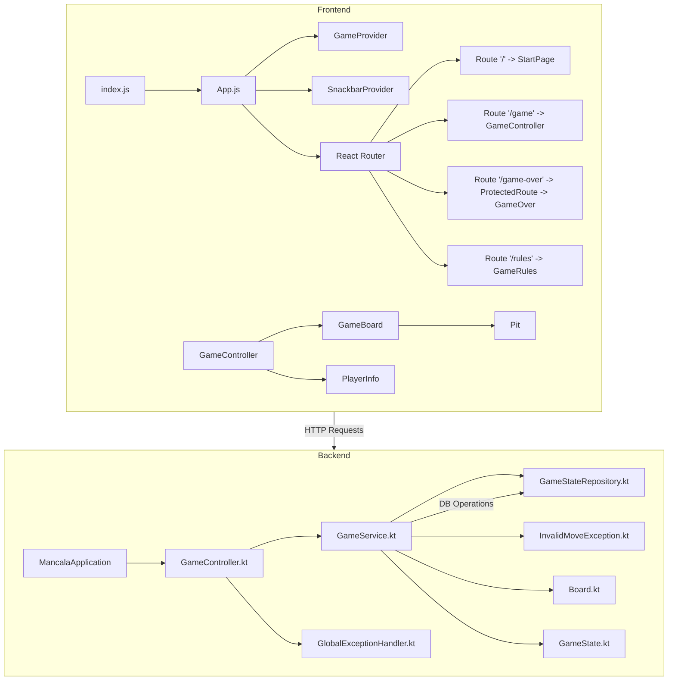
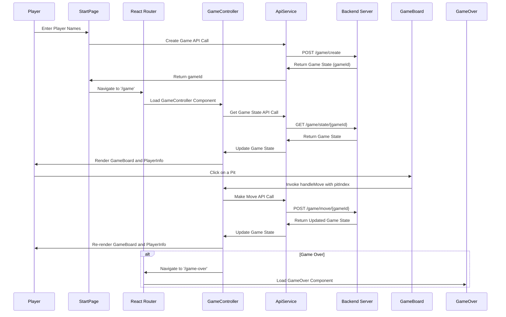
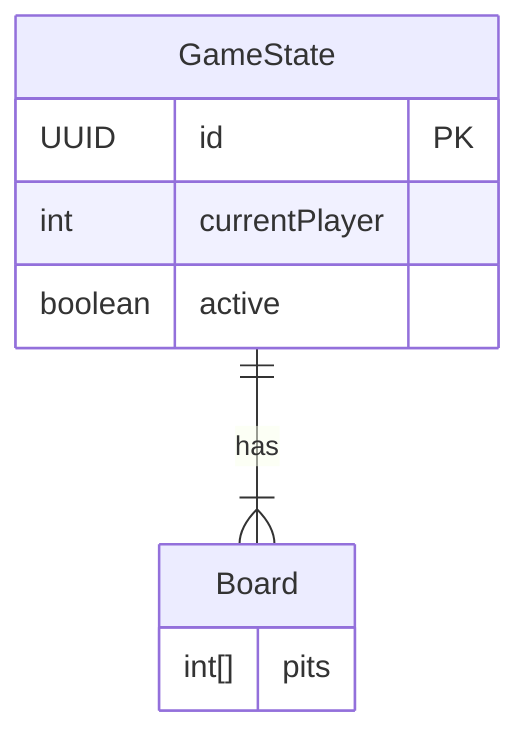

# Mancala Game

## Overview

Mancala is a classic strategy board game where the objective is to collect the most stones in your big pit. This repository contains the code for a web-based version of the Mancala game, implemented using a Kotlin-based Spring Boot backend and a React frontend.

The project is designed to allow multiple games to be hosted simultaneously on a single backend instance. The game state is managed and stored in a database, and the frontend interacts with the backend via RESTful API calls.


## Table of Contents

- [Features](#features)
- [System Architecture](#system-architecture)
- [Game Flow Sequence](#game-flow-sequence)
- [GameController Logic Flowchart](#gamecontroller-logic-flowchart)
- [Database ER Diagram](#database-er-diagram)
- [Getting Started](#getting-started)
    - [Prerequisites](#prerequisites)
    - [Installation](#installation)
- [Running the Application](#running-the-application)
    - [Backend](#backend)
    - [Frontend](#frontend)
- [Testing](#testing)
- [API Documentation](#api-documentation)
- [Technologies Used](#technologies-used)
- [Contributing](#contributing)

## Features

- **Multi-game support**: Host multiple games simultaneously on a single backend instance.
- **Interactive Gameplay**: Real-time updates of the game state with a responsive UI.
- **Rule Enforcement**: Automatic validation of game rules, including move legality and game completion.
- **Persistence**: Game state is persisted in an H2 in-memory database, allowing the game to resume after server restarts.
- **Error Handling**: Robust error handling and feedback, both on the frontend and backend.
- **Responsive Design**: The UI is designed to work across a variety of screen sizes.

## System Architecture



## Game Flow Sequence



## Database ER Diagram



## Getting Started

### Prerequisites

Ensure you have the following installed:

- [Java 17](https://www.oracle.com/java/technologies/javase-jdk17-downloads.html)
- [Node.js and npm](https://nodejs.org/)
- [Gradle](https://gradle.org/)
- [Kotlin](https://kotlinlang.org/)

### Installation

1. **Clone the repository:**

   ```bash
   git clone https://github.com/your-username/mancala-game.git
   cd mancala-game
   ```

2. **Install backend dependencies:**

   The backend dependencies are managed by Gradle and will be automatically installed when building the project.

3. **Install frontend dependencies:**

   Navigate to the `frontend` directory and install the necessary Node.js packages:

   ```bash
   cd frontend
   npm install
   ```

## Running the Application

### Backend

1. **Build the backend:**

   Navigate to the root of the project and run:

   ```bash
   ./gradlew build
   ```

2. **Run the backend server:**

   You can run the backend server using:

   ```bash
   ./gradlew bootRun
   ```

   The server will start on `http://localhost:8080`.

### Frontend

1. **Start the frontend development server:**

   Navigate to the `frontend` directory and run:

   ```bash
   npm start
   ```

   The frontend will be served on `http://localhost:3000`.

## Testing

### Backend Tests

The backend includes unit tests and integration tests using JUnit 5 and Mockito.

- To run the tests, use:

  ```bash
  ./gradlew test
  ```

- To run the integration tests:

  ```bash
  ./gradlew integrationTest
  ```

### Frontend Tests

The frontend uses Jest and React Testing Library for unit and integration tests.

- To run the frontend tests, navigate to the `frontend` directory and run:

  ```bash
  npm test
  ```

## API Documentation

The backend exposes a set of RESTful API endpoints:

- **Create a new game:**
    - **POST** `/game/create`
    - Response: `GameState`

- **Get the current game state:**
    - **GET** `/game/state/{gameId}`
    - Response: `GameState`

- **Make a move:**
    - **POST** `/game/move/{gameId}?pitIndex={pitIndex}`
    - Response: `GameState`

- **Reset the game:**
    - **POST** `/game/reset/{gameId}`
    - Response: `GameState`

Each endpoint interacts with the `GameService` to manage the game logic.

## Technologies Used

- **Backend:**
    - Kotlin
    - Spring Boot
    - H2 Database
    - JPA/Hibernate
    - JUnit 5
    - Mockito

- **Frontend:**
    - React
    - React Router
    - Notistack for notifications
    - Axios for API requests
    - Sass for styling
    - Jest and React Testing Library for testing

## Contributing

Contributions are welcome! Please follow these steps to contribute:

1. Fork the repository.
2. Create a feature branch (`git checkout -b feature-branch-name`).
3. Commit your changes (`git commit -m 'Add some feature'`).
4. Push to the branch (`git push origin feature-branch-name`).
5. Open a pull request.

Please ensure all tests pass before submitting your pull request.


